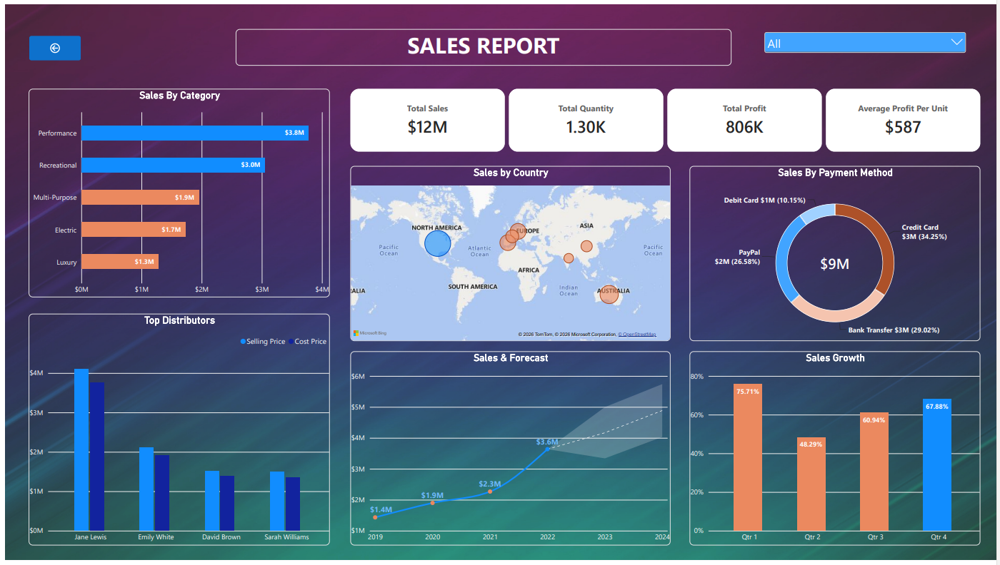
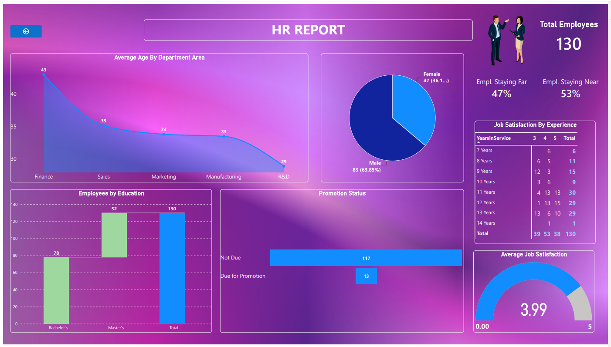

# WaveX Watercraft — Power BI Project

## About the Project

WaveX Watercraft is a Power BI project focused on exploring the company's sales and HR data.

I worked with the provided datasets to clean and transform the data, build the data model, create DAX measures, and turn the results into interactive Power BI reports.

The project was completed as part of the **Power BI Masterclass from Scratch by Navin B** on Udemy.

## What I Worked On

The project includes two main reports:

**Sales Report** — explores sales performance, product information, trends, and includes a two-year sales forecast.

**HR Report** — provides an overview of the available employee and HR-related information.

The workflow covered **Power Query, data modeling, DAX, report building, visualizations, and forecasting** in Power BI.

## Report Preview

### Sales Report

### HR Report

## Files

`WaveX_Watercraft.pbix` — Complete Power BI report

`db-imgs/` — Screenshots of the Sales and HR reports

## Tools Used

**Power BI · Power Query · DAX · Data Modeling · Data Visualization · Forecasting**

---

*Course project completed as part of the Power BI Masterclass from Scratch by Navin B.*
